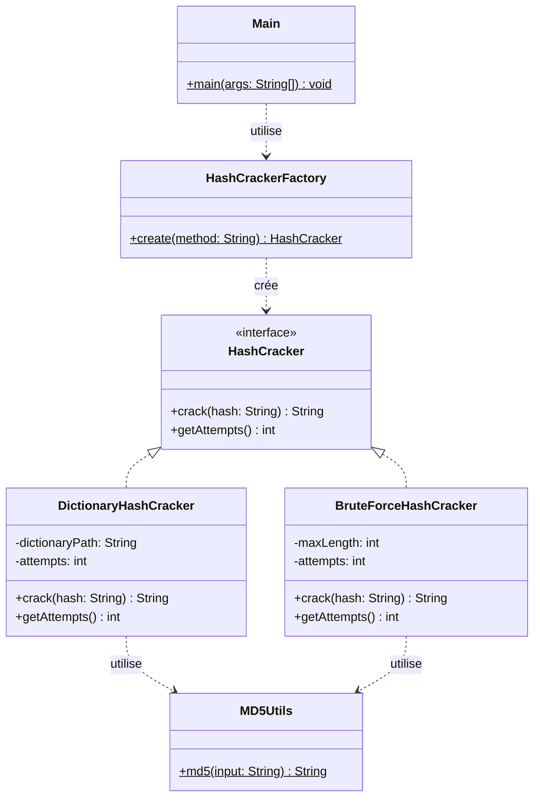

# PasswordCracker v1

Outil en ligne de commande permettant de retrouver un mot de passe à partir de son hash MD5, développé en Java selon le patron de conception **Simple Factory**.

---

## 1. Introduction

Ce projet a été réalisé dans le cadre d'un mini-projet portant sur la mise en œuvre du patron de conception créationnel **Simple Factory**. Il s'agit de développer une première version (v1) d'un outil d'audit de sécurité, **PasswordCracker**, capable de retrouver un mot de passe en clair à partir de son empreinte MD5, en utilisant deux stratégies de cassage : par dictionnaire et par force brute.

Au-delà de l'aspect fonctionnel, l'objectif pédagogique principal est de structurer le code autour d'une interface commune et d'une fabrique centralisée, afin d'éviter toute duplication et de faciliter l'ajout futur de nouvelles stratégies.

## 2. Présentation du problème

Les mots de passe ne sont en principe jamais stockés en clair dans une base de données : ils sont transformés par une fonction de hachage cryptographique (ici MD5), qui produit une empreinte de taille fixe à partir de laquelle il est théoriquement impossible de remonter directement au mot d'origine.

Dans un contexte d'audit de sécurité, il est cependant utile de pouvoir **tester la robustesse** des mots de passe utilisés, en tentant de retrouver le mot de passe original à partir de son hash, via deux approches complémentaires :

- **Attaque par dictionnaire (`DICO`)** : on teste une liste de mots courants (mots de passe fréquents, noms, dates...) en espérant que l'utilisateur ait choisi un mot de passe faible et prévisible.
- **Attaque par force brute (`BRUTE`)** : on génère et teste systématiquement toutes les combinaisons possibles de caractères (ici, lettres minuscules `a-z`, jusqu'à 4 caractères), garantissant de trouver le mot de passe s'il respecte cet espace de recherche, au prix d'un temps de calcul croissant exponentiellement avec la longueur.

Le programme doit être conçu de façon à pouvoir facilement accueillir de nouvelles stratégies (ex. attaque par masque, par règles, SHA-256...) sans modifier le code déjà en place — d'où le recours au patron Simple Factory.

## 3. Architecture

Le projet respecte une architecture strictement imposée : aucune classe concrète de stratégie n'est instanciée directement dans le programme principal ; toute création passe par la fabrique.

| Classe / Interface | Rôle |
|---|---|
| **`HashCracker`** (interface) | Contrat commun à toutes les stratégies de cassage. Définit `crack(hash): String` (retourne le mot de passe trouvé ou `null`) et `getAttempts(): int` (nombre de tentatives effectuées lors du dernier appel, pour les statistiques d'exécution). |
| **`DictionaryHashCracker`** | Implémentation concrète de la stratégie par dictionnaire. Lit un fichier texte ligne par ligne, calcule le MD5 de chaque mot via `MD5Utils`, et compare au hash recherché. |
| **`BruteForceHashCracker`** | Implémentation concrète de la stratégie par force brute. Génère toutes les combinaisons de lettres `a-z` pour des longueurs croissantes (1 à 4), en énumérant chaque combinaison à partir de sa représentation en base 26, sans jamais stocker l'espace de recherche en mémoire. |
| **`HashCrackerFactory`** | La fabrique simple. Unique point d'entrée pour la création des stratégies : `HashCrackerFactory.create("BRUTE")` ou `create("DICO")`. Lève une exception explicite si la méthode est inconnue. |
| **`MD5Utils`** | Classe utilitaire (non imposée par l'énoncé, ajoutée pour respecter la contrainte "éviter les duplications de code") centralisant le calcul du hash MD5, utilisée par les deux stratégies. |
| **`Main`** | Application console : parse les arguments `-m` et `-h`, délègue la création de la stratégie à la fabrique, mesure le temps d'exécution, et affiche le résultat ainsi que les statistiques (méthode, tentatives, temps). |

Le programme principal (`Main`) ne manipule jamais les types concrets (`DictionaryHashCracker`, `BruteForceHashCracker`) : il ne connaît que le type `HashCracker` retourné par la fabrique. C'est ce découplage qui permet le polymorphisme et respecte la contrainte de centralisation de la création des objets.

## 4. Diagramme UML



> Ce diagramme reprend la structure imposée dans l'énoncé (`HashCracker`, `DictionaryHashCracker`, `BruteForceHashCracker`, `HashCrackerFactory`) et y ajoute deux classes techniques (`MD5Utils`, `Main`) qui font partie de l'implémentation réelle mais n'étaient pas représentées dans le diagramme fourni.

## 5. Usage du patron Simple Factory

Le patron **Simple Factory** est mis en œuvre dans la classe `HashCrackerFactory`, dont l'unique méthode statique `create(String method)` centralise la logique de sélection et d'instanciation de la stratégie :

```java
public static HashCracker create(String method) {
    switch (method.toUpperCase()) {
        case "BRUTE":
            return new BruteForceHashCracker();
        case "DICO":
            return new DictionaryHashCracker();
        default:
            throw new IllegalArgumentException("Méthode de cassage inconnue : " + method);
    }
}
```

Le programme principal (`Main`) ne fait jamais `new DictionaryHashCracker()` ou `new BruteForceHashCracker()` directement : il appelle uniquement `HashCrackerFactory.create(method)` et manipule le résultat via le type abstrait `HashCracker` :

```java
HashCracker cracker = HashCrackerFactory.create(method);
String password = cracker.crack(hash);
```

Cette indirection permet de :
- centraliser en un seul endroit la logique "quel type instancier selon quel critère" ;
- masquer au code appelant l'existence des classes concrètes ;
- ajouter facilement une nouvelle stratégie sans toucher à `Main`.

## 6. Résultats obtenus

Le programme a été compilé (JDK 21) et testé avec succès sur plusieurs scénarios réels (hash MD5 calculés indépendamment pour validation) :

| # | Commande | Résultat | Tentatives | Temps |
|---|---|---|---|---|
| 1 | `-m DICO -h 098f6bcd4621d373cade4e832627b4f6` (MD5 de "test") | `Password found: test` | 6 | 44 ms |
| 2 | `-m DICO -h ffffff...` (hash inventé) | `Password not found` | 10 | 41 ms |
| 3 | `-m DICO -h 531ba498ac8690f1a72034843b5fd7fd` (MD5 de "senegal", dernier mot du dico) | `Password found: senegal` | 10 | 383 ms |
| 4 | `-m DICO -h 098F6BCD...` (même hash que #1, en MAJUSCULES) | `Password found: test` | 6 | 48 ms |
| 5 | `-m BRUTE -h 187ef4436122d1cc2f40dc2b92f0eba0` (MD5 de "ab") | `Password found: ab` | 28 | 43 ms |
| 6 | `-m BRUTE -h fbade9e36a3f36d3d676c1b808451dd7` (MD5 de "z") | `Password found: z` | 26 | 44 ms |
| 7 | `-m BRUTE -h 098f6bcd4621d373cade4e832627b4f6` (MD5 de "test") | `Password found: test` | 355 414 | 690 ms |
| 8 | `-m BRUTE -h aaaaaa...` (hash inventé, recherche exhaustive) | `Password not found` | 475 254 | 549 ms |
| 9 | `-m FOO -h abcd` (méthode invalide) | `Erreur : Méthode de cassage inconnue : FOO` | — | — |

Les résultats des tests #5, #7 et #8 correspondent exactement aux valeurs attendues par le calcul théorique (26 lettres, puis 26² = 676, 26³ = 17 576, 26⁴ = 456 976 combinaisons), ce qui confirme la correction de l'algorithme de génération de combinaisons.

**Vidéo de présentation** : *(à insérer ici — lien YouTube/Drive de la démonstration, durée max. 10 minutes, montrant l'exécution des deux modes et des cas d'erreur ci-dessus)*.

## 7. Difficultés rencontrées

- **Encodage des caractères accentués en console** : lors des premiers tests, les caractères accentués (`é`, `è`) s'affichaient sous forme de `?` dans certains terminaux (notamment sous Windows). Solution : forcer explicitement l'encodage UTF-8 du flux de sortie (`System.setOut(new PrintStream(System.out, true, "UTF-8"))`) au démarrage de `Main`.
- **Éviter la duplication du calcul MD5** : les deux stratégies ont besoin de calculer un hash MD5. Plutôt que de dupliquer ce code, il a été extrait dans une classe utilitaire dédiée (`MD5Utils`), conformément à la contrainte de l'énoncé.
- **Génération efficace des combinaisons en force brute** : une implémentation récursive naïve aurait pu fonctionner, mais une génération itérative basée sur la conversion d'un compteur en base 26 (chaque "chiffre" correspondant à une lettre) s'est avérée plus simple à maîtriser et à vérifier manuellement (le nombre de tentatives attendu se calcule facilement à la main, ce qui a permis de valider la correction de l'algorithme).
- **Rapporter des statistiques (tentatives, temps) sans polluer l'interface** : plutôt que de faire un cast vers les classes concrètes dans `Main` (ce qui aurait cassé l'abstraction), la méthode `getAttempts()` a été ajoutée directement dans l'interface `HashCracker`, chaque stratégie l'implémentant selon sa propre logique de comptage.

## 8. Conclusion

Cette première version de PasswordCracker répond à l'ensemble des contraintes imposées : les deux stratégies de cassage (dictionnaire et force brute) sont implémentées derrière une interface commune, et leur création est entièrement centralisée dans une fabrique simple, sans qu'aucune classe concrète ne soit instanciée directement dans le programme principal.

Le patron Simple Factory a permis de découpler le code appelant des implémentations concrètes, au prix d'une limite bien identifiée (voir Annexe ci-dessous) : la fabrique elle-même doit être modifiée à chaque ajout de nouvelle stratégie, ce qui ouvre la voie à des évolutions futures (Factory Method, Abstract Factory) pour une v2 du projet.

---

## Annexe — Questions de réflexion

**1. Quels avantages apporte la fabrique simple ?**

- Elle centralise en un seul endroit la logique de décision "quelle classe instancier selon quel critère", évitant de disperser des `if`/`switch` dans tout le programme.
- Elle découple le code appelant (`Main`) des classes concrètes : celui-ci ne connaît que l'interface `HashCracker`, jamais `DictionaryHashCracker` ni `BruteForceHashCracker` directement.
- Elle facilite la maintenance : un seul point de code à modifier si la logique de création évolue (ex. ajout d'un paramètre de configuration à l'instanciation).
- Elle simplifie les tests : on peut facilement substituer une implémentation par un mock via la même interface.

**2. Quels sont ses inconvénients ?**

- Elle **viole le principe Open/Closed** (voir question 4) : ajouter une stratégie oblige à modifier le corps de la fabrique.
- Elle n'est pas un véritable patron de conception au sens du Gang of Four (contrairement à *Factory Method* ou *Abstract Factory*) : c'est davantage une pratique de bon sens qu'un patron formel, ce qui est parfois débattu dans la littérature.
- Pour un grand nombre de stratégies, la méthode `create()` peut devenir longue et difficile à maintenir (un `switch` géant).
- Elle centralise une responsabilité unique dans une classe statique, ce qui peut la rendre plus difficile à étendre dynamiquement (par exemple, impossible d'enregistrer une nouvelle stratégie à l'exécution sans modifier le code source, contrairement à un registre de fabriques).

**3. Que faut-il modifier lorsqu'une nouvelle stratégie est ajoutée ?**

Concrètement, pour ajouter par exemple une stratégie `MaskHashCracker` (attaque par masque) :

1. Créer la nouvelle classe `MaskHashCracker implements HashCracker` et implémenter `crack()` et `getAttempts()`.
2. **Modifier `HashCrackerFactory.create()`** pour ajouter un nouveau `case` correspondant (ex. `"MASK"`).

Le point 2 est précisément la limite du Simple Factory : il est impossible d'ajouter une stratégie sans toucher au code existant de la fabrique. Les autres classes (`Main`, `HashCracker`) restent, elles, totalement inchangées.

**4. La fabrique respecte-t-elle le principe Open/Closed ?**

Non. Le principe Open/Closed stipule qu'une classe doit être **ouverte à l'extension mais fermée à la modification**. Or, ajouter une nouvelle stratégie de cassage nécessite de modifier directement le corps de la méthode `create()` (ajout d'un `case` dans le `switch`), ce qui constitue une violation directe de ce principe.

Pour corriger ce point dans une future version, on pourrait envisager :
- un **Factory Method** (chaque sous-classe de fabrique sait créer un seul type de stratégie, et le code appelant choisit la bonne fabrique par polymorphisme) ;
- ou un **registre de fabriques** (`Map<String, Supplier<HashCracker>>`) alimenté dynamiquement, permettant d'enregistrer une nouvelle stratégie sans modifier la classe `HashCrackerFactory` elle-même.
